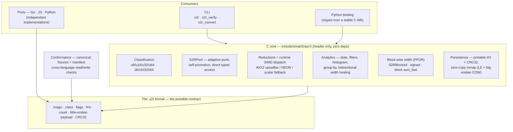

# Smart2Raw

**Adaptive numeric storage for integer data.**

Smart2Raw is a lightweight library and portable binary format for storing large integer arrays using the smallest native integer width that safely represents the actual data range: 8, 16, 32 or 64 bits, signed or unsigned.

The core idea is simple:

> **Classify once. Operate forever in the most compact native format.**

Instead of storing everything as `int64` or `int32` by default, Smart2Raw scans the real value range and selects the smallest native type that preserves every value. After that, operations run directly on the compact representation: sum, min, max, count, filters, statistics, group-by, persistence and memory-mapped reads, without decompression and without manual bit-packing.

---

## Why this matters

Many systems store small values in unnecessarily large types.

A sensor temperature like `25` does not need 64 bits. An age fits in `u8`. HTTP status codes fit in `u16`. Many counters, flags, categories, buckets, local IDs, token IDs and discrete measurements use only a fraction of the bits normally reserved for them.

At small scale, this looks harmless. At millions or billions of values, it becomes expensive:

- more RAM usage;
- more memory bandwidth;
- more cache pressure;
- more I/O;
- more energy consumption;
- fewer values per cache line;
- fewer records fitting in the same device, server or embedded system.

Smart2Raw reduces that waste by storing integers in the smallest native width that fits the data while keeping direct indexed access.

---

## What Smart2Raw is

Smart2Raw is:

- a C header-only library;
- a portable `.s2r` binary format;
- a compact integer storage layer;
- a lightweight scan and aggregation engine;
- a set of CLI tools and examples;
- a base for useful ports in other languages;
- a practical way to reduce memory, cache misses, bandwidth and I/O when integer ranges are smaller than their declared types.

It is designed to work from servers to edge devices and embedded systems.

---

## What Smart2Raw is not

Smart2Raw is not a magic compression layer for every kind of data.

It is **not**:

- a general-purpose compressor;
- a replacement for audio, video or image codecs;
- a format for encrypted data;
- a replacement for already-compressed data formats;
- a dense linear algebra engine;
- a replacement for GEMM, BLAS, tensor cores or matrix kernels;
- a floating-point quantizer;
- a full columnar database;
- a replacement for Parquet, Arrow, ClickHouse or DuckDB.

Smart2Raw works best when the data is integer-based, the real range is smaller than the default type, and the bottleneck is memory, bandwidth, cache, scanning, I/O or aggregation.

---

## Mental model

Imagine 1 million temperature readings between 0 and 60 C.

Stored as `int64`:

```text
1,000,000 values x 8 bytes = 8 MB
```

Stored with Smart2Raw as `u8`:

```text
1,000,000 values x 1 byte = 1 MB
```

The numerical result is the same. The machine simply moves fewer bytes.

Fewer bytes means more values per cache line, less memory traffic, faster scans, lower memory footprint and better use of the same hardware.

---

## Quickstart in C

```c
#include "smart2raw.h"

int main(void) {
    S2RPool pool;

    s2r_pool_init(&pool, S2R_8, 1024);

    for (uint64_t v = 0; v < 1000; v++) {
        s2r_push_adaptive(&pool, v);
    }

    uint64_t total = s2r_sum_fast(&pool);

    s2r_pool_free(&pool);
    return 0;
}
```

`push_adaptive` automatically promotes the pool when a new value no longer fits the current width.

For example:

```text
u8 -> u16 -> u32 -> u64
```

No silent truncation. No manual type guessing.

---

## Core principle

Smart2Raw replaces this habit:

```text
Use int64 everywhere just to be safe.
```

with this rule:

```text
Use the smallest native integer type that preserves every value.
```

The core classes are:

```text
Unsigned: u8, u16, u32, u64
Signed:   i8, i16, i32, i64
```

After classification, data access remains native and direct. Smart2Raw does not require per-access bit masks or shifts like manual bit-packing.

---

## Main features

### Adaptive integer width

Smart2Raw selects the smallest class that fits the real data range.

Unsigned classes:

```text
0..255              -> u8
0..65,535           -> u16
0..4,294,967,295    -> u32
larger              -> u64
```

Signed classes:

```text
-128..127           -> i8
-32,768..32,767     -> i16
-2^31..2^31-1       -> i32
larger              -> i64
```

### Adaptive push

When a new value does not fit the current width, the pool promotes itself automatically.

```text
u8 -> u16 -> u32 -> u64
```

This avoids silent overflow and truncation.

### Bidirectional width healing

If an outlier forces a pool to grow and that outlier is later removed, the pool can be reclassified back to a smaller width.

```text
u8 -> outlier inserted -> u64
u64 -> outlier removed -> fit_class() -> u8
```

### Safe scalar arithmetic

Scalar operations can promote the pool when needed instead of wrapping around silently.

### Lazy-carry arithmetic

A chain of scalar operations can track the worst-case magnitude and promote only once at commit time.

This reduces reallocations and avoids intermediate overflows.

### SIMD-aware reductions

The C implementation can use hardware-specific optimized paths when available.

On x86 with AVX2, byte summation can use `vpsadbw`, which performs horizontal byte sums in hardware and avoids costly widening patterns.

When the optimized path is not available, Smart2Raw falls back to scalar code.

### Zero-copy memory mapping

`.s2r` files can be memory-mapped and scanned directly without copying the entire dataset into RAM.

This is useful for:

- edge devices;
- sensor history;
- quantized artifacts;
- startup-sensitive services;
- datasets larger than available RAM;
- read-only analytics.

### Portable `.s2r` format

Smart2Raw defines a compact binary format:

```text
magic
class
flags
format version
count
little-endian payload
CRC32
```

The payload is written in canonical little-endian order. CRC32 allows corruption detection.

### Block-wise width

In addition to one width for the whole array, Smart2Raw supports block-wise width.

This reduces the impact of outliers: a large value inflates only its own block instead of forcing the entire collection to use a wider class.

### Lightweight analytics

Smart2Raw includes operations useful for scans and lightweight analytics:

- sum;
- min;
- max;
- mean;
- variance;
- standard deviation;
- count by condition;
- range filters;
- histograms;
- group-by count;
- group-by sum;
- signed-aware statistics.

---

## Architecture

Smart2Raw is layered around a single idea: **the on-disk format is the contract, and everything else orbits it.** That is what lets a file written by the C core be read by the Go, JavaScript or Python ports without any shared runtime.



### Layers

1. **The `.s2r` format (the contract).** A fixed 16-byte header (`magic`, `class`, `flags`, `fmt`, `count`) plus a canonical little-endian payload and a trailing `CRC32`. Fixed offsets let an mmap reader locate the payload directly. Because the contract is just bytes, ports do not need to link the C core — they re-implement reading and writing of the same bytes.

2. **The C core (`include/smart2raw.h`).** Header-only and dependency-free, organized in modules:
   * **Classification** — picks the smallest class (`u8..u64`, `i8..i64`) that preserves the real range.
   * **`S2RPool`** — the container: data buffer, current class, count, and capacity. `push_adaptive` promotes the class in place (`u8 → u16 → u32 → u64`) without truncation; access stays native and indexed (no per-element masks/shifts).
   * **Reductions + runtime SIMD dispatch** — `sum/min/max/count` choose an AVX2 (`vpsadbw`) or NEON path at runtime, with a scalar fallback, so the same source runs everywhere.
   * **Analytics** — statistics, range filters, histograms, group-by, `S2RTracked` (O(1) min/max on push), and bidirectional width *healing* (shrink back when an outlier is removed).
   * **Block-wise width (PFOR)** — `S2RBlocked` gives each block its own class so an outlier inflates only its block; signed variants and a SIMD block-sum are included.
   * **Persistence** — portable `.s2r` I/O with CRC32, and zero-copy mmap (including a big-endian copy-on-write path that leaves the on-disk file untouched).
   * **Build-time gates** — `S2R_NO_STDIO`, `S2R_NO_MMAP`, `S2R_NO_SIMD` strip the core down for microcontrollers (~3.4 KB) up to full server builds, from one file.

3. **Consumers.** The **CLI** (`s2r`, `s2r_verify`, `s2r_convert`) and the **Python binding** (`ctypes` over a small stable C ABI in `s2r_capi.c`) sit directly on the C core. The **ports** (Go, JS, Python) are *independent implementations* of the format — not bindings — which is why they live under `ports/` rather than `bindings/`.

4. **Conformance.** `conformance/` holds canonical `.s2r` fixtures plus a `manifest.json` of expected values; the runner has the C tools verify/aggregate each fixture, confirms the corrupted fixture is rejected, and runs the Go/JS/Python suites against the same bytes. This is what turns "portable format" from a claim into a checked contract.

### Data flow

```text
ingest        classify + pack       -> smallest native class
operate       in place, no decode   -> reductions/filters/analytics (SIMD per class)
persist       portable write        -> .s2r + CRC32
consume       mmap / scan / port    -> zero-copy reads, cross-language
```

### Key design decisions

* **Format first.** Interop is a property of the bytes, not of a shared library — so any language can join by implementing the contract.
* **Operate on the compact form.** No decompression step: the compact buffer *is* the working representation, and indexed access stays native.
* **Capacity is in elements, storage tracks the class.** Promotion reallocates to the new width; the empty-pool path also re-fits capacity to the buffer (the fix shipped in 3.3.5).
* **One source, many targets.** Runtime SIMD dispatch and compile-time gates let the same header serve MCUs and servers.
* **Honest scope.** The core does storage, scanning and auxiliary reductions — never the dense matrix multiply; that boundary is deliberate and is reflected throughout the code and docs.


## Where Smart2Raw can help

Smart2Raw is useful whenever you store many integers and suspect they occupy more space than they need.

### IoT and edge

Sensor and edge data often consists of small integers:

- temperature;
- humidity;
- pressure;
- luminosity;
- device states;
- counters;
- discrete events.

In RAM- and flash-constrained devices, every byte matters.

### Telemetry, logs and metrics

Operational data is often integer-heavy:

- HTTP status codes;
- latency buckets;
- error codes;
- counters;
- flags;
- metric windows;
- local IDs;
- compact event types.

Smart2Raw can reduce memory footprint and accelerate scans, counts, sums and filters.

### Lightweight analytics

For integer columns with small ranges, Smart2Raw can act as a compact scan layer.

It does not try to replace mature columnar engines. Instead, it is useful when you need a small, dependency-light component for agents, tools, embedded analytics, local processing or custom pipelines.

### Feature stores and ML preprocessing

Many tabular ML features are discrete:

- categories;
- buckets;
- IDs;
- flags;
- ranges;
- counters;
- quantized features.

Smart2Raw can reduce footprint and speed up per-column scans and aggregations.

### Artificial intelligence

Smart2Raw does not replace GEMM, tensor cores, VNNI, BLAS or specialized matrix kernels.

Its role in AI is different: storage, movement and auxiliary reductions around integer data.

Potential use cases include:

- quantized artifacts;
- integer weights or activations;
- token IDs;
- integer indices;
- discrete features;
- quantized feature stores;
- KV-cache layouts with localized outliers;
- zero-point correction sums in asymmetric quantization;
- memory-mapped quantized data;
- analysis and preprocessing of integer tensors.

Smart2Raw does not perform the main matrix multiplication. It helps with the integer storage and scan-heavy operations around it.

### Embedded systems

The C core can be built in small configurations by disabling stdio, mmap and SIMD paths.

Possible targets include:

- firmware;
- microcontrollers;
- FreeRTOS;
- Zephyr;
- ESP32;
- STM32;
- Arduino / PlatformIO;
- Raspberry Pi Pico.

### Servers

On servers, Smart2Raw is most useful when a workload is memory-, cache-, bandwidth- or I/O-bound.

Examples:

- metrics services;
- log processing;
- event counters;
- time-window aggregations;
- in-memory integer columns;
- systems storing `int64` or `int32` by default even when values fit in `u8` or `u16`.

### Architectures and platforms

The core is designed to be portable.

Natural targets include:

- Linux x86_64;
- Linux ARM64;
- macOS x86_64;
- macOS Apple Silicon;
- Windows x64;
- WebAssembly;
- Node.js;
- browsers;
- Android through the NDK;
- iOS through C/Swift wrappers;
- embedded systems;
- RISC-V through the scalar C path;
- RISC-V Vector as a future SIMD target.

The canonical implementation is C. Ports exist to make the same idea useful in other ecosystems.

---

## Ports and ecosystem

The canonical implementation lives in:

```text
include/smart2raw.h
```

Additional ports live in:

```text
ports/
```

Current ecosystem:

```text
ports/go       -> services, telemetry and backend systems
ports/js       -> Node.js, browser demos and .s2r readers/writers
ports/python   -> notebooks, tutorials and conformance fixtures
```

There may also be bindings for the C core under:

```text
bindings/
```

The goal of these ports is not to create artificial variations. Each port exists for a real technical ecosystem.

---

## Format conformance

The `conformance/` directory contains canonical `.s2r` fixtures and cross-language format tests.

The goal is to ensure that `.s2r` is a real portable contract, not just an internal detail of the C implementation.

Examples:

```text
C writes           -> Go reads
C writes           -> JavaScript reads
C writes           -> Python reads
Go writes          -> other languages read
JavaScript writes  -> other languages read
Python writes      -> other languages read
```

---

## Measured results

Actual speedups depend on the hardware, compiler, data distribution, working-set size and baseline.

Measured results from the project include:

| Mechanism | Measured result |
|---|---:|
| Memory vs `int64` for 8-16 bit data | 75-87.5% less |
| Min/max reductions with vectorization | 8-10x |
| SIMD `u8` sum | 2.8-10x |
| SIMD `u16` sum | 1.4-4x |
| 4-way histogram on skewed data | 3.6-4x |
| `u8 -> u32` group sum | ~1.78 G rows/s |
| int8 zero-point correction | 2.3x |
| Block-wise width with 0.01% outliers | ~3.7x memory recovery |
| SIMD block sum for zero-point support | ~6.7x |
| Class-based zone-map scan | up to 94.5% bandwidth avoided in measured scenario |
| MCU build without stdio/mmap/SIMD | ~3.4 KB |

These numbers are not universal promises. They show where the mechanism works.

---

## When Smart2Raw does not help much

Smart2Raw is not expected to provide large gains when the data is already dense, random, encrypted, compressed or naturally large.

Examples:

- encrypted data;
- already-compressed files;
- compressed audio;
- compressed video;
- compressed images;
- high-entropy random data;
- raw floating-point data that has not been quantized;
- dense matrix multiplication;
- payloads where every value truly requires 64 bits;
- data already stored as `int8` with no outliers and no need for a container;
- domain-specific queues or formats that are already heavily optimized.

In such cases, Smart2Raw may still provide a format, CRC, mmap or API layer, but the main memory gain may disappear.

---

## Design philosophy

Smart2Raw follows a few rules:

1. Measure before claiming.
2. Separate measured gains from estimates.
3. Do not claim to be a general-purpose compressor.
4. Do not promise speedups for dense computation.
5. Treat mmap mainly as capacity and I/O improvement, not universal acceleration.
6. Acknowledge that mature columnar systems already use related ideas in their own domains.
7. Focus on where a lightweight integer storage layer is actually useful: edge, telemetry, embedded systems, lightweight analytics, services and support operations around larger pipelines.

---

## Build and test

Run the main C test suite:

```sh
bash scripts/build_and_test.sh
```

Expected result:

```text
14 suites OK, 0 failures
```

Run ports:

```sh
cd ports/go && go test ./...
cd ports/js && npm test
cd ports/python && python -m unittest discover -s tests
```

Run conformance:

```sh
bash conformance/run_conformance.sh
```

---

## Repository layout

```text
include/
  smart2raw.h              C header-only library

tools/
  s2r                      main CLI
  s2r_convert              converter
  s2r_verify               verifier

examples/
  usage examples

tests/
  C suites, regressions, analytics, mmap, SIMD and PFOR tests

benchmarks/
  measured experiments

docs/
  whitepaper
  .s2r format specification
  technical documentation

bindings/
  language bindings for the C core

ports/
  go/
  js/
  python/

conformance/
  .s2r fixtures
  cross-language format tests

notebooks/
  reproducible experiments

scripts/
  build, test and utility scripts
```

---

## Roadmap

Planned or natural next steps:

- Rust port;
- WebAssembly playground;
- embedded examples for FreeRTOS, Zephyr, ESP32 and STM32;
- Windows memory-mapping backend;
- Android NDK wrapper;
- Swift wrapper for Apple platforms;
- SQLite extension;
- DuckDB adapter;
- Arrow bridge;
- RISC-V scalar validation;
- RISC-V Vector SIMD path;
- broader ARM NEON validation on real hardware;
- block-wise `.s2r` serialization;
- sub-byte experimental mode for int4-style use cases.

---

## License

Smart2Raw is licensed under:

```text
AGPL-3.0-or-later
```

Commercial licensing may be available for proprietary, closed-source or AGPL-incompatible use.

See:

```text
LICENSE
LICENSING.md
NOTICE
EDITIONS.md
```

---

## Citation

If you use Smart2Raw in research, benchmarks, papers, reports, products or technical comparisons, please cite the project using:

```text
CITATION.cff
```

Releases can be archived on Zenodo with versioned DOIs.

---

## One-sentence summary

Smart2Raw is a portable layer for storing and operating on integer data in the smallest native format that preserves the values, reducing memory, cache pressure, bandwidth and I/O whenever the real data range is smaller than the types normally used by default.
